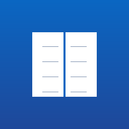

# Address Book

A personal address book desktop application for Windows, built with **Electron + React + TypeScript + SQLite**. It ingests contacts from multiple file formats, consolidates them into a single portable SQLite database, and includes a scaffolded LinkedIn integration for keeping contact details current.



## Features

- **Unified contact list** — searchable, sortable (Name / Company / City / Last Updated), with a left list panel and right detail panel.
- **Search & filter** — search across name, company, email, and phone; filter chips for **All**, **Favorites**, and **Tags**.
- **Add / Edit / Delete** contacts with a full field form.
- **Multi-format import**:
  - **CSV** — with a column → field mapping dialog
  - **vCard / VCF** — vCard 2.1 and 3.0
  - **JSON** — array of contact objects
  - **Excel (.xlsx)** — first-row headers with a mapping dialog
  - **Plain text** — best-effort name / email / phone / URL detection
- **Duplicate detection** on import (by email, or first + last name + company) with **Skip / Merge / Create new**, plus an import summary.
- **Export** to CSV, vCard, and JSON.
- **LinkedIn integration** (scaffolded) — open a contact's LinkedIn profile (or a search) in the browser, stamp a "last updated" date, batch-process all contacts with LinkedIn URLs, and an OAuth `Connect` entry point ready to wire up.
- **Settings** — database path, theme (light / dark), LinkedIn Client ID.
- **Portable database** — the `.db` file lives outside the app bundle in `Documents/AddressBook`, so you can back it up, move it, or share it.
- **First-launch flow** — prompts to create a new database (seeded with 10 sample contacts) or open an existing one.
- **Native Windows menu** — File, Edit, View, LinkedIn, Help.

## Install (end users)

1. Download the latest `Address Book Setup x.y.z.exe` from the Releases page.
2. Run the installer. You can choose the install directory; Desktop and Start Menu shortcuts are created.
3. On first launch, choose **Create New Database** (recommended) — it will be created in `Documents/AddressBook/addressbook.db` and seeded with sample contacts.

## Usage

- **Add a contact**: toolbar **+ Add Contact** or `Ctrl+Shift+A`.
- **Search**: type in the search box or press `Ctrl+F`.
- **Import**: **File → Import →** choose a format. For CSV/Excel you'll map columns to fields, then choose how to handle duplicates.
- **Export**: **File → Export →** CSV / vCard / JSON.
- **LinkedIn**: select a contact and use **LinkedIn → Update Selected Contact** (opens the profile/search in your browser), or **Update All Contacts** to batch-process everyone with a LinkedIn URL. Add a LinkedIn Client ID in **Settings** to enable the OAuth `Connect` flow.
- **Theme**: toggle light/dark in **Settings**.

### Data file location

- Database: `Documents/AddressBook/addressbook.db` (configurable via **File → Open Database** / Settings).
- `data/master-contacts.json` is the **full contact database** (11,352 consolidated contacts from 5 source files). It is bundled with the installer and seeded into the database on first launch.
- `data/sample-contacts.json` holds the first 10 records of the master database for a lightweight seed/demo experience.
- The installer copies these data files to `Documents/AddressBook/` on first run; the database is seeded if it's empty.

## Development

```bash
npm install            # install dependencies (compiles better-sqlite3 native module)
node scripts/make-icon.js   # (re)generate the placeholder app icon
npm run build          # compile main + renderer into dist/
npm start              # build main and launch Electron
npm test               # run Jest unit/integration tests
npm run dist           # build + produce the Windows NSIS installer (run on Windows)
```

### Project structure

```
address-book/
├── src/
│   ├── main/        # Electron main process (index, database, ipc-handlers, menu, linkedin, preload, settings)
│   ├── renderer/    # React UI (App + components + styles)
│   └── shared/      # types, IPC channel names, import parsers, exporters
├── data/
│   ├── master-contacts.json   # full contact database (11,352 contacts), bundled & seeded
│   └── sample-contacts.json   # first 10 records for a lightweight seed/demo
├── tests/           # Jest tests (parsers, duplicates, CRUD, components)
├── assets/          # generated app icon
├── electron-builder.yml
└── webpack.*.config.js
```

### Notes on the build

- The renderer is fully sandboxed: `contextIsolation: true`, `nodeIntegration: false`. All main↔renderer communication goes through a typed `contextBridge` API defined in `src/main/preload.ts`.
- `better-sqlite3` is a native module and is kept external from the webpack bundle; `electron-builder` packages it for the installer.
- `npm run dist` produces the `.exe` and is intended to run on Windows. `npm run build` (compilation) and `npm test` run on any platform.

## License

MIT
